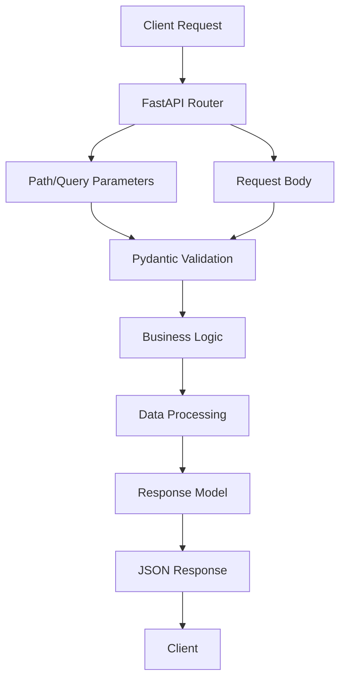
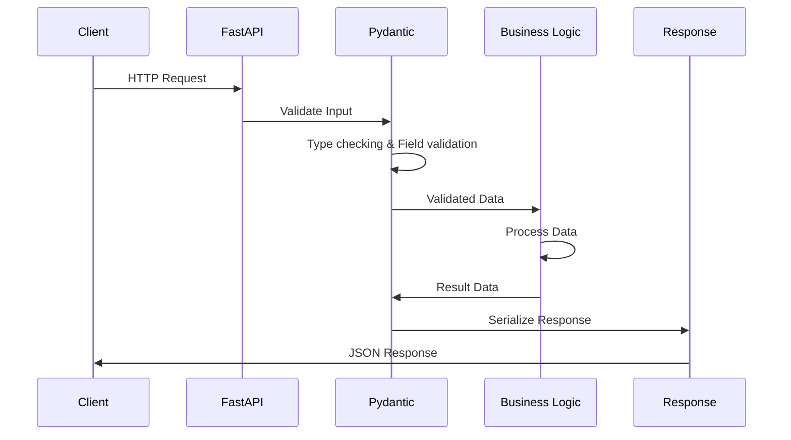

# FastAPI-Pydantic-Docker

This repository demonstrates the fundamental concepts of **Pydantic**, **FastAPI**, and **Docker** through two practical projects:
1. Patient Management System API (`/fundamentals`)
2. Insurance Premium Prediction API (`/insurance_premium_prediction`)

## 🔧 Pydantic Fundamentals

### Core Concepts

**What is Pydantic?**
- Python library for data validation using Python type annotations
- Automatically validates, serializes, and deserializes data
- Provides clear error messages for invalid data

### Key Features Implemented

#### 1. **BaseModel Classes**
```python
class Patient(BaseModel):
    id: str
    name: str 
    age: int
```

#### 2. **Field Validation with Annotated Types**
```python
age: Annotated[int, Field(..., gt=0, lt=120, description='Age of the patient')]
weight: Annotated[float, Field(..., gt=0, description='Weight in kg')]
```

**Field Parameters:**
- `...` - Required field
- `gt/lt` - Greater than/Less than validation
- `description` - Field documentation
- `examples` - Example values for API docs

#### 3. **Literal Types for Restricted Values**
```python
gender: Literal['male', 'female', 'others']
occupation: Literal['retired', 'freelancer', 'student', ...]
```

#### 4. **Computed Fields (Dynamic Properties)**
```python
@computed_field
@property
def bmi(self) -> float:
    return self.weight/(self.height**2)  # Auto-calculated when model is created
```
*Computed fields automatically calculate values based on other fields*

#### 5. **Field Validators**
```python
@field_validator('city')
@classmethod
def normalize_city(cls, v: str) -> str:
    return v.strip().title()  # Clean and format city names
```
*Custom validation logic that runs before storing field values*

#### 6. **Optional Fields for Updates**
```python
class PatientUpdate(BaseModel):
    name: Optional[str] = Field(default=None)
    age: Optional[int] = Field(default=None, gt=0)
```
*Allows partial updates where only provided fields are changed*

#### 7. **Model Methods**
- `model_dump()` - Convert to dictionary
- `model_dump(exclude='id')` - Exclude specific fields
- `model_dump(exclude_unset=True)` - Only include set fields

### Validation Flow
```
Input Data → Pydantic Model → Validation → Cleaned Data/Error
```

---

## 🚀 FastAPI Fundamentals

### Core Concepts

**What is FastAPI?**
- Modern, fast web framework for building APIs with Python
- Automatic API documentation (Swagger/ReDoc)
- Built-in request/response validation using Pydantic

### Key Features Implemented

#### 1. **FastAPI App Creation**
```python
app = FastAPI()
```

#### 2. **HTTP Methods & Endpoints**

| Method | Endpoint | Purpose |
|--------|----------|---------|
| GET | `/` | Home/Welcome message |
| GET | `/view` | List all patients |
| GET | `/patient/{id}` | Get specific patient |
| POST | `/create` | Create new patient |
| PUT | `/edit/{id}` | Update patient |
| DELETE | `/delete/{id}` | Delete patient |

#### 3. **Path Parameters**
```python
@app.get('/patient/{patient_id}')
def view_patient(patient_id: str = Path(..., description='Patient ID')):
```
*Path parameters extract values from URL path (e.g., `/patient/P001` extracts `P001`)*
*Used for resource identification - which specific item you want to access*

#### 4. **Query Parameters**
```python
@app.get('/sort')
def sort_patients(
    sort_by: str = Query(..., description='Sort field'),
    order: str = Query('asc', description='Sort order')
):
```
*Query parameters come after `?` in URL (e.g., `/sort?sort_by=age&order=desc`)*
*Used for filtering, sorting, pagination - how you want to modify the response*

#### 5. **Request Body Validation**
```python
@app.post('/create')
def create_patient(patient: Patient):  # Automatic validation
```

#### 6. **Response Models**
```python
@app.post('/predict', response_model=PredictionResponse)
def predict_premium(data: UserInput):
```

#### 7. **Exception Handling**
```python
if patient_id not in data:
    raise HTTPException(status_code=404, detail='Patient not found')
```

#### 8. **JSON Responses**
```python
return JSONResponse(status_code=201, content={'message': 'Success'})
```

#### 9. **Dependency Injection** *(Common in Industry)*
```python
def get_db():  # Database connection dependency
    return database_connection

@app.get('/users')
def get_users(db = Depends(get_db)):  # Inject dependency automatically
```
*Reuses common logic (DB connections, auth) across endpoints without repetition*

#### 10. **CORS Middleware** *(Essential for Web Apps)*
```python
from fastapi.middleware.cors import CORSMiddleware
app.add_middleware(CORSMiddleware, allow_origins=["*"])  # Allow all origins
```
*Enables frontend applications to call your API from different domains*

#### 11. **File Uploads** *(Common API Feature)*
```python
from fastapi import UploadFile, File
@app.post('/upload')
def upload_file(file: UploadFile = File(...)):  # Built-in file handling
```
*Handle file uploads with automatic validation and metadata extraction*

#### 12. **API Documentation**
FastAPI automatically generates:
- **Swagger UI**: `/docs`
- **ReDoc**: `/redoc`
- **OpenAPI Schema**: `/openapi.json`

### Project Architecture Flow



---

## 🐳 Docker Fundamentals

### Core Concepts

**What is Docker?**
- Platform for containerizing applications
- Ensures consistent environment across development, testing, and production
- Packages application with all dependencies

### Key Components Implemented

#### 1. **Dockerfile Structure**
```dockerfile
FROM python:3.12-slim          # Base image - lightweight Python runtime
WORKDIR /app                   # Working directory inside container
COPY requirements.txt .        # Copy dependencies first (Docker layer caching)
RUN pip install -r requirements.txt  # Install dependencies in separate layer
COPY . .                       # Copy application code
EXPOSE 8000                    # Document port usage (doesn't actually publish)
CMD ["uvicorn", "main:app", "--host", "0.0.0.0", "--port", "8000"]  # Default startup command
```
*Layer-based approach optimizes build speed through caching*

#### 2. **Dockerfile Instructions**

| Instruction | Purpose | Example |
|------------|---------|---------|
| `FROM` | Base image | `python:3.12-slim` |
| `WORKDIR` | Set working directory | `/app` |
| `COPY` | Copy files to container | `COPY . .` |
| `RUN` | Execute commands | `pip install -r requirements.txt` |
| `EXPOSE` | Document port usage | `8000` |
| `CMD` | Default command | `uvicorn main:app` |

#### 3. **.dockerignore File**
Excludes unnecessary files from Docker build context:
```
__pycache__/
*.pyc
.vscode/
.git/
venv/
```

#### 4. **Essential Docker Commands**

```bash
docker build -t myapp .                    # Build image from Dockerfile
docker run -p 8000:8000 myapp             # Run container with port mapping
docker run -d --name myapp-container myapp # Run detached with custom name
docker ps                                  # List running containers
docker ps -a                              # List all containers (including stopped)
docker stop container_name                 # Stop running container
docker rm container_name                   # Remove stopped container
docker images                             # List all images
docker rmi image_name                     # Remove image
docker logs container_name                # View container logs
docker exec -it container_name bash      # Enter running container shell
```

#### 9. **DockerHub Commands**
- **Consistency**: Same environment everywhere
- **Isolation**: Each container is independent  
- **Portability**: Run anywhere Docker is installed
- **Scalability**: Easy to scale horizontally
```bash
docker login                              # Login to DockerHub
docker tag myapp username/myapp:v1.0     # Tag image for push
docker push username/myapp:v1.0          # Push image to DockerHub  
docker pull username/myapp:v1.0          # Download image from DockerHub
docker search nginx                      # Search images on DockerHub
```

#### 6. **Environment Variables** *(Production Standard)*
```bash
docker run -e DATABASE_URL=postgres://... my-app  # Set environment variable
docker run --env-file .env my-app               # Load variables from file
```
*Pass configuration to containers without hardcoding values*

#### 7. **Volume Mounting** *(Data Persistence)*
```bash
docker run -v /host/path:/container/path my-app  # Mount host directory
docker run -v mydata:/app/data my-app           # Use named volume
```
*Persist data outside containers so it survives container restarts*

---

## 📁 Project Structure Analysis

### `/fundamentals` - Patient Management System
```
fundamentals/
├── main.py          # FastAPI app with CRUD operations
├── patients.json    # JSON file database
└── frontend.py      # Streamlit frontend
```

**Key Learning Points:**
- File-based data storage
- Complete CRUD operations
- Path and Query parameter handling
- Exception handling

### `/insurance_premium_prediction` - ML API
```
insurance_premium_prediction/
├── main.py              # FastAPI app
├── model/predict.py     # ML prediction logic
├── schema/              # Pydantic models
├── config/              # Configuration files
├── Dockerfile           # Container definition
└── requirements.txt     # Dependencies
```

**Key Learning Points:**
- Structured project organization
- ML model integration
- Advanced Pydantic features
- Production-ready Docker setup

---

## 🔄 Request-Response Flow



---


---

## 🚀 Quick Start

1. **Run Patient Management API:**
```bash
cd fundamentals
pip install fastapi uvicorn
uvicorn main:app --reload
```

2. **Run Insurance Prediction API:**
```bash
cd insurance_premium_prediction
pip install -r requirements.txt
uvicorn main:app --reload
```

3. **Run with Docker:**
```bash
cd insurance_premium_prediction
docker build -t insurance-api .
docker run -p 8000:8000 insurance-api
```

4. **Access API Documentation:**
- Swagger UI: `http://localhost:8000/docs`
- ReDoc: `http://localhost:8000/redoc`

---

## 📚 Learning Progression

1. **Start with Pydantic**: Learn data validation and serialization
2. **Build FastAPI endpoints**: Create REST APIs with automatic documentation  
3. **Containerize with Docker**: Package for consistent deployment

This repository provides a solid foundation for building production-ready APIs with modern Python tools.
